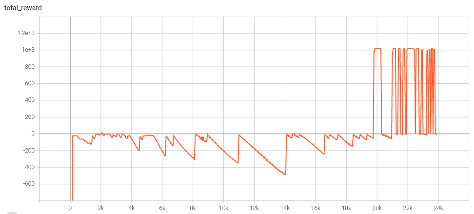

# Reinforcement-learning

This project details on the basics of reinforcement learning and seeks to solve the problem of source seeking in a simulated environment. We simulate a drone in AirSim that learns to find the source of a signal. The drone uses a heat signature sensor (dummy) to reach the human to avoid obstacles in the AirSim Neighbourhood environment. 

### Paths 

1. `./Report submission/` contains monthly reports for this project. Report 1 covers the basics of RL. Report 2 and 3 details the approach in solving the source seeking problem using DQN and DDPG respectively.
2. `./src/` contains code for implementing DDPG, DQN, and Q-learning. The code is written using Pytorch-Lightning, Hydra, Pytorch, and AirSim.
3. `./Papers/` contains the seminal papers of DDPG and DQN. 
4. `./Lecture/` contains lecture resources that I found helpful in the process.

### Outputs

1. #### DDPG

   ##### Video

   The source of the signal is inside the house across the road.

   

   ##### Reward vs. iterations

   A reward of 1000 is given every time the drone reaches the goal and -10 when the drone crashes. 

   

   

2. **DQN**

   ##### Video

   The source of the signal is inside the house across the road.

   

3. ##### Training

   ##### Video

   Training visualization

   

### Contributor

- Rahul Sajnani